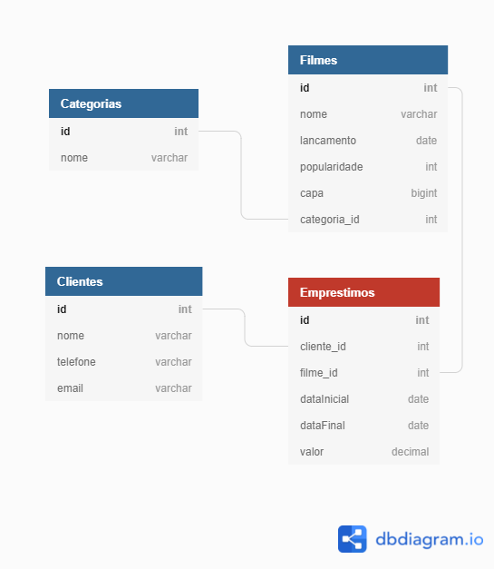

# Loucadora

Um simples projeto de "locadora" feito com Nest.js (não é next!)

nest.js é um framework em typescript que segue os conceitos do Spring Boot. 



## Installation

```bash
$ npm install
```

And:

  - Copy .env.example to .env
  - Create a database at elephantsql.com
  - Add url,user,pass...etc to .env file

## Running the app

```bash
# development
$ npm run start

# watch mode
$ npm run start:dev

# production mode
$ npm run start:prod
```

Após iniciar a app, você pode usar o arquivo `api.http` para realizar as chamadas à api. Instale a extensão "REST Client" no seu vscode.

## Test

```bash
# unit tests
$ npm run test

# e2e tests
$ npm run test:e2e

# test coverage
$ npm run test:cov
```

## License

Nest is [MIT licensed](LICENSE).
